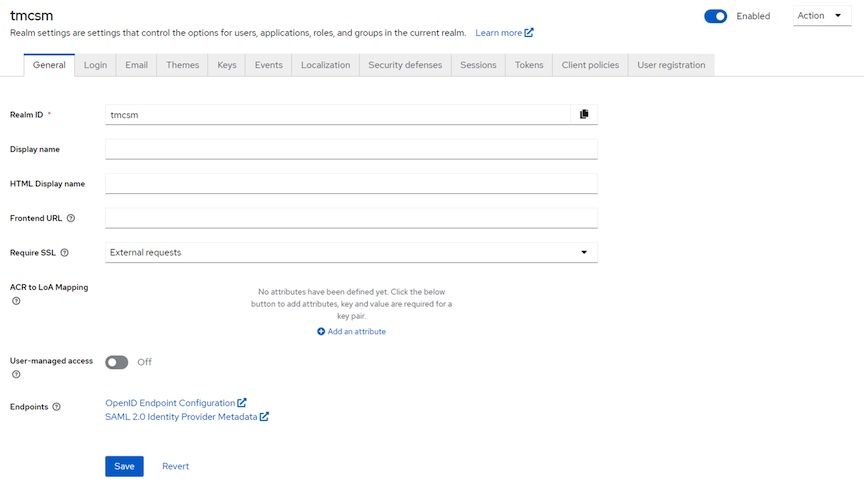
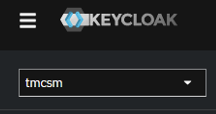
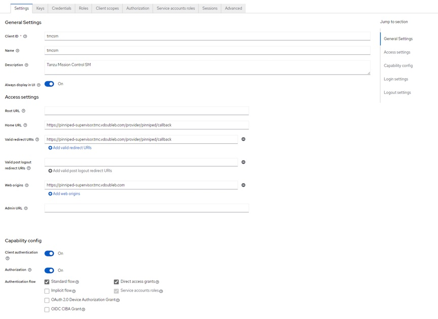
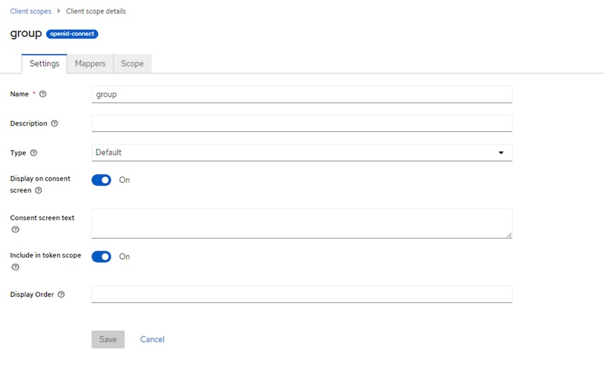
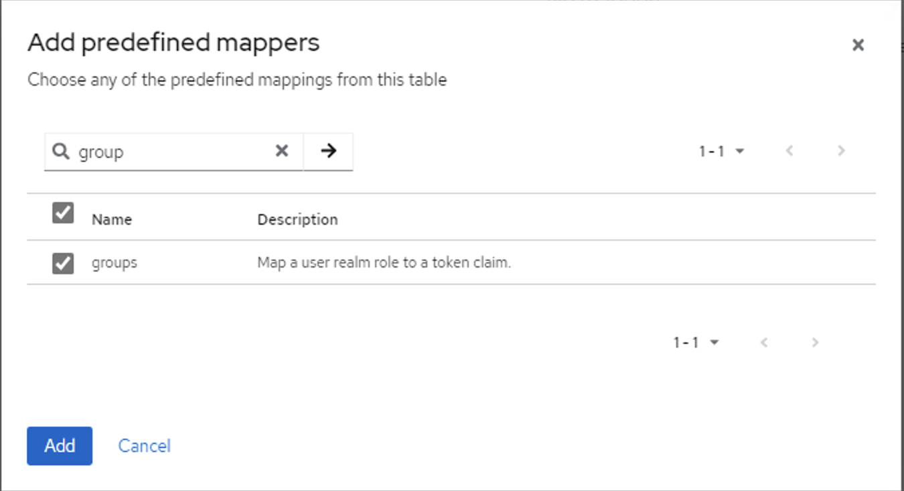
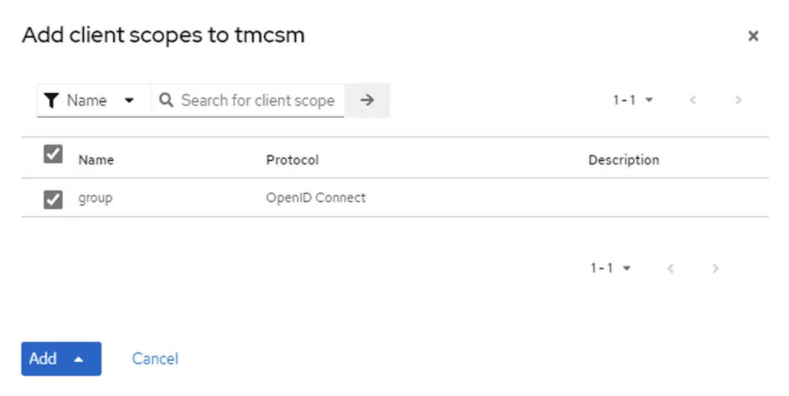
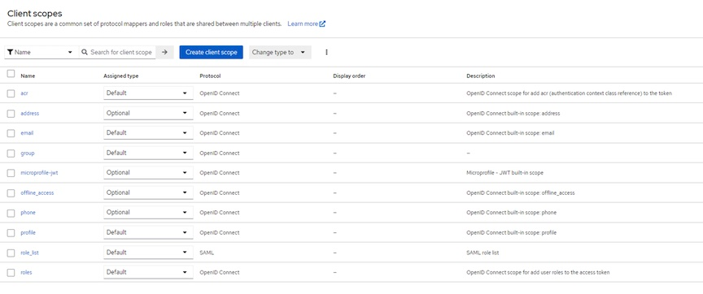
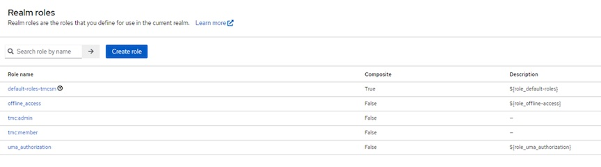

In a [previous post](_posts/2023-09-21-Keycloak-Install.md) I detailed an quick install of Keycloak on a Linux VM. Several of the Tanzu products (TAP, Tanzu Mission Control Self-Managed, and Tanzu Kubernetes Grid) use Pinniped for OIDC authentication.  Keycloak is an idea product for providing the OIDC authentication.  In the post I detail how to configure a Keycloak realm and client that can be used for Tanzu Mission Control Self-Managed.


## Configuring Realm, Client, Users and Groups for TMC Self-Managed

1. Login to Keycloak UI https://keycloak.example.com:8443

### Create tmcsm realm

1. Create Realm: Pull Down on master realm and click *Create Realm*
- Realm name: tmcsm
- Make sure enabled slider is on
2. View Realm by selecting Realm settings in left menu. You should not need to change any other settings



**Note: All of the following steps are done under the tmcsm realm**



### Create tmcsm client

1. Create tmcsm client: Clients -> Create client scope
- Client Type: OpenID Connect
- Client ID: tmcsm
- Name: none 
- -> Next
- Client authentication slider: ON
- Client authorization slider: ON
- Authentication flow: no changes needed
- -> Next
- Home URL: https://pinniped-supervisor.tmc.example.com/provider/pinniped/callback
- Valid redirct URL: https://pinniped-supervisor.tmc.example.com/provider/pinniped/callback
- Save



### Create group Client Scope

1. Create Client Scope for group: Client scopes -> Create client scope
- Name: group
- Type: default
- Protocol: OpenID Connect
- Leave remaining settings unchanged
- Save



2. Add Mapper for group Client scope: While viewing group Client Scope after save in step 2
- Select Mappers tab
- Click: Add predefined mapper
- Search: group
- Select the groups mapper
- Add



### Add group Client Scope to tmcsm Client

1. Add group Client Scope to tmscm Client: Clients -> tmcsm -> Client scopes tab -> Add client scope
- group should show as option
- Select group and Add -> Default



2. Completed Client Scope tab should look like this:



### Create Realm Roles for Tanzu Self-Managed Required Groups

Tanzu Self-Managed v1.0.1 requires hard-coded groups tmc:admin and tmc:memeber in the OIDC provider.  You need to create these realm roles

1. Create tmc:amdin Realm role: Realm roles -> Create Role
- Role Name: tmc:admin
- Save
2. Create tmc:member Realm role: Realm roles -> Create Role
- Role Name: tmc:member
- Save



### Add User 

1. Add Local User: Users -> Add user
- Username: What ever
- Email: email@example.com - We use email to log in so please include email even if its not valid
- Email Verified Slide: Yes - Avoids need to validate email
- First / Last Name: Can be left blank or completed
- Create

### Add Group, Group Member(s) and Role Mapping

1. Add tmc:admin group: Groups -> Create group
- Name: tmc:admin
2. Create tmc:member group: Groups -> Create group
- Name: tmc:member
3. Add user to admin group: Groups -> tmc:admin -> Members Tab -> Add member
- Select one of the users you created that you want to be admin in TMC Self-Managed
- Add
4. Assign Role mapping: Role mapping tab -> Assign role
- Select tmc:admin
- Assign
5. Repeat for tmc:member group if desired

This completes the configuration of the tmcsm OIDC client to be used with Tanzu Mission Control Self-Managed.  The next step is to configure the Pinniped section of the TMC SM values.yaml

## Configure Pinniped Provider in TMC SM Values.yaml

### tmcsm realm OIDC issuer

1. Obtain OIDC endpoint for Keycloak tmcsm client
```
https://keycloak.example.com:8443/realms/tmcsm/.well-known/openid-configuration/
```
2. We are interested in the "issuer" form the configuration which in our case is:
```
https://keycloak.example.com:8443/realms/tmcsm
```
3. You can also get to the above open-id configuration in web UI: tmcsm realm -> Realm Settings -> Endpoints - OpenID Endpoint Configuration

### Client ID and Client Secret

1. Client ID in our case is tmcsm
2. Obtain Client Secret: tmcsm realm -> Clients -> tmcsm -> Credentials tab
- Copy client secret. Will be used in value.yaml for TMC SM

### Edit values.yaml you have for TMC Self-Managed

1. Complete the OIDC section of values.yaml with the information you obtained above
```
oidc:
  issuerType: "pinniped"
  issuerURL: "https://keycloak.exmaple.com:8443/realms/tmcsm"
  clientID: "tmcsm"
  clientSecret: "axJoysKhaeBdklsisRt2fFrGXv7UGo7p1kxZ"
trustedCAs:
  idp-ca.pem: |
    -----BEGIN CERTIFICATE-----
     MIID6zCCAtOgAwIBAgIUO/AHkP..........
    -----END CERTIFICATE-----
```
2. If your Keycloak uses self-signed CA you will need to have the idp-ca.pem section under trusted CAs and put the CA.crt certificate that Keycloak cert was signed by. 

Once you successfully install Tanzu Mission Control Self-Managed you will be redirected to Keycloak to authenticate (use email address) and then redirected back to pinniped and then TMC SM UI.


**Disclaimer:** All posts, contents and examples are for educational purposes only and does not constitute professional advice. No warranty and user excepts All information, contents, opinions are my own and do not reflect the opinions of my employer. Most likely you shouldn’t listen to what I’m saying and should close this browser window immediately